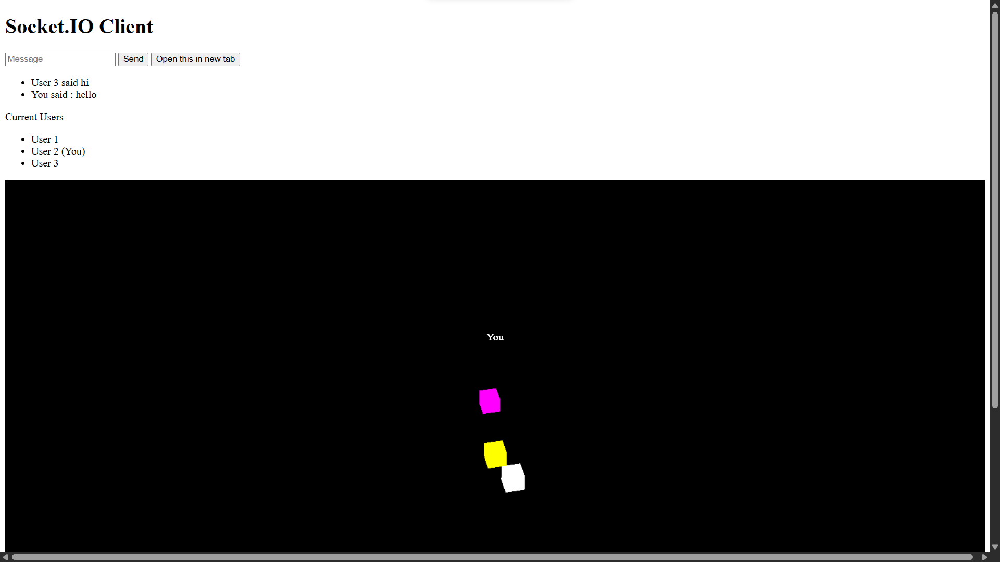

# Basic Socket.io Demo

A bare minimum Socket.io implementation. Learn about [Websockets & Socket.io](https://youtu.be/1BfCnjr_Vjg) on Youtube. 



## Run it

```
cd server
npm install
npm start
node server.js
```

Open the `app/index.html` file in a browser. WASD for controls.

## Current Issue
When a new player join, the older player's position is not updated until he/she moves